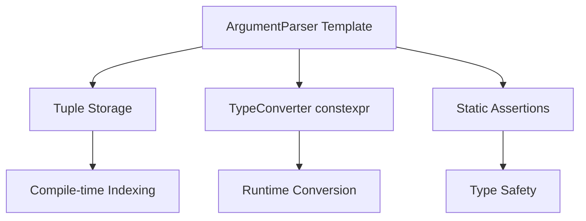

# C++ Template Metaprogramming Refactoring Plan for CLI Parser

## Current Codebase Analysis

The CLI parser is a header-only C++ library with the following structure:

- **ArgumentParser**: Main class managing options, uses runtime polymorphism with `ArgumentBase` and `Argument<T>`.
- **TypeConverter<T>**: Template for converting strings to types (int, float, string, vector<T>).
- **Validation**: Runtime checks for argument length and bounds.
- **Error Handling**: Simple error formatting.

Current issues for metaprogramming refactoring:
- Runtime polymorphism introduces vtable overhead.
- Type conversions happen at runtime.
- Limited compile-time safety.

## Refactoring Goals

1. **Template-based Argument System**: Replace virtual inheritance with templates to eliminate runtime overhead.
2. **Compile-time Calculations**: Use constexpr for validations and type checks.
3. **Optimized Type System**: Leverage SFINAE, static_assert, and variadic templates.
4. **Maintain Functionality**: Ensure API remains similar for backward compatibility.
5. **Improve Maintainability**: Better error messages and extensibility.

## Proposed Architecture

### 1. Template-based Argument Storage
Use a tuple to store arguments at compile time, eliminating dynamic allocation and virtual calls.

```cpp
template<typename... Args>
class ArgumentParser {
    std::tuple<Args...> arguments_;
    // ...
};
```

### 2. Compile-time Type Conversion
Enhance TypeConverter with constexpr where possible.

```cpp
template<typename T>
struct TypeConverter {
    static constexpr bool is_convertible = /* compile-time check */;
    static T convert(const std::string& str);
};
```

### 3. Variadic Template Options
Allow adding options at compile time.

```cpp
template<typename T, typename... Rest>
void add_option(const std::string& short_name, const std::string& long_name, const std::string& desc, bool required, T default_val, Rest... rest);
```

### 4. Static Assertions
Add compile-time checks for type safety.

```cpp
static_assert(TypeConverter<T>::is_convertible, "Type T is not supported for conversion");
```

## Implementation Steps

1. **Phase 1: Core Refactoring**
   - Replace ArgumentBase with template-only system.
   - Implement tuple-based storage.

2. **Phase 2: Compile-time Enhancements**
   - Add constexpr to TypeConverter specializations.
   - Implement compile-time validation.

3. **Phase 3: API Adjustments**
   - Maintain add_option interface but make it template-driven.
   - Ensure get<T> works with new system.

4. **Phase 4: Testing and Examples**
   - Update examples to demonstrate new features.
   - Add tests for compile-time checks.

## Benefits

- **Performance**: Eliminate virtual function calls and dynamic casting.
- **Safety**: Compile-time type checking prevents runtime errors.
- **Extensibility**: Easier to add new types and validations.
- **Maintainability**: Less runtime code, more declarative.

## Example Refactored Code

```cpp
// Before: Runtime polymorphism
parser.add_option<std::string>("-f", "--file", "Input file", true);

// After: Template-based with compile-time checks
parser.add_option<std::string>("-f", "--file", "Input file", true);
static_assert(TypeConverter<std::string>::is_convertible, "String conversion not supported");
```

## Mermaid Diagram



## Risks and Mitigations

- **Complexity**: Template metaprogramming can be hard to debug. Mitigate with clear error messages.
- **Compatibility**: Ensure existing code compiles. Provide migration guide.
- **Performance**: Measure compile times; use forward declarations where possible.

## Next Steps

Review this plan and approve for implementation. Once approved, switch to code mode for refactoring.